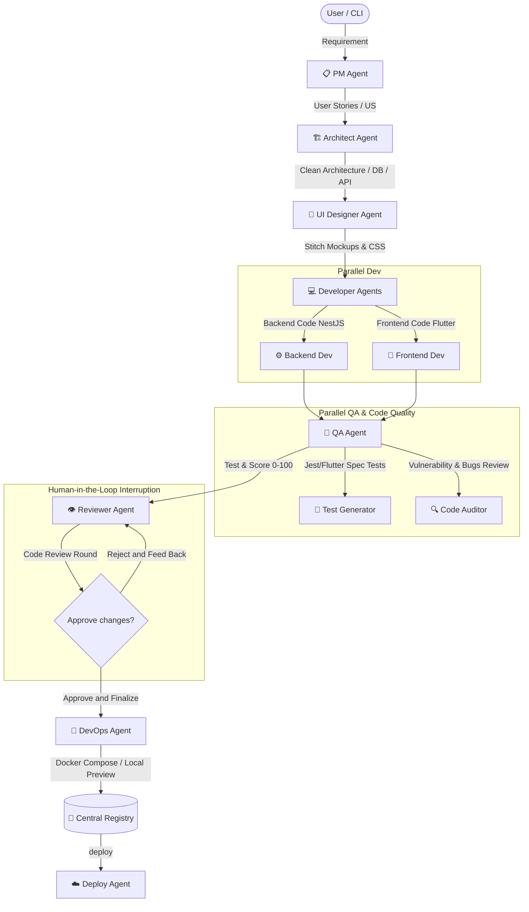

# devAIteam 🚀
### The most advanced autonomous, local AI software development team platform

`devAIteam` is a state-of-the-art multi-agent platform built on top of **LangGraph** and optimized to run 100% locally with hybrid-thinking language models (such as **Qwen3.6-35B** via MLX or Ollama). The platform orchestrates an entire virtual software development team that collaborates sequentially and in parallel to transform a simple user requirement into real, fully-tested, human-reviewed, production-ready code.

---

## 🏛️ Multi-Agent Pipeline Architecture

The virtual team's workflow follows the traditional Software Development Life Cycle (SDLC) in an automated, highly-structured manner:



---

## 🌟 Key Features

1. **Complete Virtual Team**: 8 specialized agent roles collaborating seamlessly to build your application.
2. **Real Human-in-the-Loop**: The *Code Reviewer* conducts a meticulous code audit, proposes exact patch snippets, and pauses execution waiting for human approval or feedback to trigger refinement rounds.
3. **Smart Local Preview**: The *DevOps Agent* automatically provisions a local stack with `docker-compose` (NestJS + Nginx + PostgreSQL) or runs local background processes (Node + Flutter), falling back gracefully to LLM-generated instructions if tools are missing.
4. **Powerful Multi-command CLI**: Control the entire suite using the native `devAIteam` executable command to generate, list, deploy, or clean up projects.
5. **Centralized Project Registry**: Real-time tracking of code file counts, QA quality scores, GitHub Pull Request URLs, local folder sizes, and cloud deploy status under `./output/.registry.json`.
6. **Cloud Deployment Integration**: Direct deployments of your projects to **Fly.io**, **Railway**, and **Render** based on automatically detected local tools.
7. **Safe Cleanups (Soft & Total Modes)**: Remove local code folders to free up disk space, or perform a total deletion that connects with the **GitHub MCP** to close PRs, delete heads/branches, and clean up repos automatically.

---

## 🛠️ Virtual Agent Roles

* **📋 Product Manager (PM Agent)**: Analyzes user requirements and drafts detailed User Stories with priority levels and story point estimations.
* **🏗️ Software Architect (Architect Agent)**: Designs the project topology (Clean Architecture), API REST endpoints, Entity-Relationship database models, and Mermaid diagrams with Context7 MCP support.
* **🎨 UI/UX Designer (Designer Agent)**: Formulates design systems and interactive screens utilizing the Google Stitch API.
* **💻 Developers (Backend & Frontend Agents)**: Write parallel, complete, and functional NestJS (TypeScript) and Flutter (Dart) source files with no placeholders, powered by the Filesystem MCP.
* **🧪 QA Agent (Test & Quality Auditor)**: Audits security/reliability (presents a 0 to 100 quality score) and autogenerates robust unit and widget test files.
* **👁️ Tech Lead / Code Reviewer (Reviewer Agent)**: Reviews the source code and QA outputs, manages human approvals, and commits refinement parches via the GitHub MCP.
* **🚀 DevOps Engineer (DevOps Agent)**: Manages local Docker environments, orchestrates browser previews, and manages startup verification.
* **☁️ Cloud Deployer (Deploy Agent)**: Packages deployment configurations and scripts for instant cloud launch.

---

## 📦 Installation and Setup

### Prerequisites
* **Python 3.12** or higher.
* **uv** (An ultra-fast Python package installer).
* Local **MLX** or **Ollama** server running at `http://localhost:8000/v1` with the model `Qwen3.6-35B-A3B-UD-MLX-4bit` active.

### Step 1: Clone and Install Dependencies
```bash
git clone https://github.com/nicolasmg-pr/devAIagent.git
cd devAIagent
uv sync
```

### Step 2: Configure Environment Variables
Create or modify your `.env` file in the project root to enable credentials for your virtual agents (this file is securely protected in `.gitignore`):

```env
# Cloud Deploy Tokens (Optional)
FLY_API_TOKEN=your_fly_token_here
RAILWAY_TOKEN=your_railway_token_here
RENDER_API_KEY=your_render_api_key_here

# GitHub Integrations (Highly Recommended for Code Review & RM commands)
GITHUB_OWNER=nicolasmg-pr
GITHUB_REPO=devAIagent
GITHUB_PERSONAL_ACCESS_TOKEN=your_github_pat_token

# Google Stitch Keys (Optional for UI Designer)
STITCH_API_KEY=your_stitch_api_key_here
```

### Step 3: Activate and Use the CLI
Activate your virtual environment:
```bash
source .venv/bin/activate
```
The **`devAIteam`** command is now fully registered in your shell!

---

## 🎮 CLI Usage Guide

### 1. Initiate a New Project
To start the pipeline and generate an application from scratch:
```bash
devAIteam "I want a mobile app to manage cooking recipes and weekly nutritional menus"
```
*If you run `devAIteam` with no arguments, a gorgeous Unicode dashboard will load and prompt you for the project description interactively.*

### 2. List Generated Projects
Get a beautifully formatted table representing all generated projects, scores, folder sizes, and links:
```bash
devAIteam list
```

### 3. Deploy to the Cloud
Deploy your selected local project to Fly.io, Railway, or Render instantly:
```bash
devAIteam deploy expensemaster-mobile
```

### 4. Delete Project (Soft Mode)
Safely deletes the local directory `./output/{project}` to free up disk space, keeping remote repositories and deployments intact:
```bash
devAIteam rm expensemaster-mobile
```

### 5. Deletion of All Resources (Total Mode)
Stops containers, purges the local folder, cleans the index in `.registry.json`, and triggers the **GitHub MCP** to close pull requests and delete repository branches automatically:
```bash
devAIteam rm expensemaster-mobile --all
```
