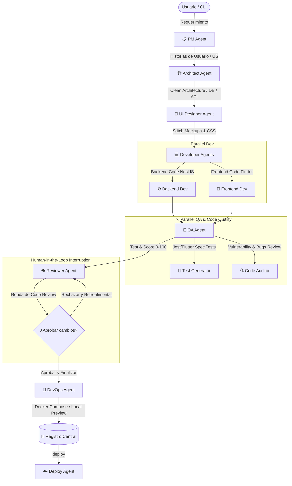

# devAIteam 🚀
### El equipo virtual de desarrollo de software autónomo y local más avanzado

`devAIteam` es una plataforma multi-agente construida sobre **LangGraph** y optimizada para ejecutarse en local con modelos de lenguaje híbridos (como **Qwen3.6-35B** vía MLX u Ollama). La plataforma simula un equipo completo de desarrollo de software que colabora de manera secuencial y en paralelo para transformar un requerimiento de usuario en código real, testeado, validado por humanos y listo para desplegar.

---

## 🏛️ Arquitectura del Pipeline Multi-Agente

El flujo del equipo sigue el ciclo de vida de desarrollo de software (SDLC) tradicional de forma automatizada:



---

## 🌟 Características Principales

1. **Equipo Virtual Completo**: 8 roles de agentes especializados que colaboran coordinadamente.
2. **Human-in-the-Loop Real**: El agente *Code Reviewer* realiza una revisión exhaustiva, propone parches de código exactos e interrumpe la ejecución esperando aprobación o feedback del usuario para iniciar rondas de refinamiento.
3. **Vista Previa Local Inteligente**: El agente *DevOps* levanta contenedores locales con `docker-compose` (NestJS + Nginx + PostgreSQL) o procesos locales en background (Node + Flutter), con fallback a instrucciones detalladas por LLM si el entorno carece de herramientas.
4. **CLI Multiuso Potente**: Accede a toda la suite mediante el comando ejecutable nativo `devAIteam` para generar, listar, desplegar o limpiar proyectos.
5. **Registro de Proyectos Centralizado**: Seguimiento en tiempo real del tamaño del código, puntajes de calidad QA, URLs de Pull Requests y estado de despliegue en `./output/.registry.json`.
6. **Gestión de Despliegue en la Nube**: Despliegues simplificados de tus proyectos en **Fly.io**, **Railway** y **Render** en base a las herramientas detectadas automáticamente.
7. **Borrado Seguro (Modos Soft & Total)**: Elimina el código local para liberar almacenamiento en disco, o realiza un borrado total interactuando de forma real con el **GitHub MCP** para cerrar PRs, ramas y repositorios.

---

## 🛠️ Roles del Equipo

* **📋 Product Manager (PM Agent)**: Analiza el requerimiento del usuario y define las historias de usuario con prioridades y puntos de historia estimados.
* **🏗️ Software Architect (Architect Agent)**: Diseña la topología de la aplicación (Clean Architecture), endpoints de la API, modelo entidad-relación y diagramas Mermaid con soporte del Context7 MCP.
* **🎨 UI/UX Designer (Designer Agent)**: Integra sistemas de diseño y pantallas móviles interactivas haciendo uso de la API real de Google Stitch.
* **💻 Developers (Backend & Frontend Agents)**: Escriben en paralelo el código NestJS (TypeScript) y Flutter (Dart) de forma completa, estructurada y sin placeholders utilizando el Filesystem MCP.
* **🧪 QA Agent (Test & Quality Auditor)**: Audita la seguridad/calidad (puntuación de 0 a 100) y autogenera suites físicas de pruebas Jest y tests unitarios Dart.
* **👁️ Tech Lead / Code Reviewer (Reviewer Agent)**: Revisa el código del desarrollador y del QA, propone cambios interactivos y solicita aprobación humana con integración real de GitHub MCP.
* **🚀 DevOps Engineer (DevOps Agent)**: Configura Docker, automatiza el preview de la aplicación y la integra con el navegador del desarrollador.
* **☁️ Cloud Deployer (Deploy Agent)**: Compila y empaqueta las configuraciones de lanzamiento en la nube de forma transparente.

---

## 📦 Instalación y Configuración

### Requisitos Previos
* **Python 3.12** o superior
* **uv** (Gestor de paquetes ultra-rápido de Python)
* Servidor local **MLX** o **Ollama** activo en `http://localhost:8000/v1` con el modelo `Qwen3.6-35B-A3B-UD-MLX-4bit`.

### Paso 1: Clonar e instalar dependencias
```bash
git clone https://github.com/nicolasmg-pr/devAIagent.git
cd devAIagent
uv sync
```

### Paso 2: Configurar Variables de Entorno
Crea o edita tu archivo `.env` en la raíz del proyecto para habilitar los accesos de tus agentes virtuales (el archivo está protegido en `.gitignore`):

```env
# Tokens de Despliegue Cloud (Opcionales)
FLY_API_TOKEN=tu_token_de_fly
RAILWAY_TOKEN=tu_token_de_railway
RENDER_API_KEY=tu_clave_api_de_render

# Integración con GitHub (Recomendado para Code Review & RM)
GITHUB_OWNER=nicolasmg-pr
GITHUB_REPO=devAIagent
GITHUB_PERSONAL_ACCESS_TOKEN=tu_token_pat_de_github

# Key de Google Stitch (Opcional para UI Designer)
STITCH_API_KEY=tu_clave_api_de_stitch
```

### Paso 3: Activar y utilizar el CLI
Activa tu entorno virtual:
```bash
source .venv/bin/activate
```
¡El comando `devAIteam` ya está registrado globalmente en tu terminal!

---

## 🎮 Guía de Uso del CLI

### 1. Iniciar un Nuevo Proyecto de Software
Para iniciar el pipeline y construir una aplicación desde cero:
```bash
devAIteam "Quiero una app móvil para gestionar recetas de cocina y menús semanales"
```
*Si ejecutas `devAIteam` sin argumentos, se desplegará el menú interactivo solicitándote los datos.*

### 2. Listar Proyectos Generados
Obtén un resumen estructurado en formato tabular de todos tus proyectos, puntajes de calidad, tamaños en disco y URLs:
```bash
devAIteam list
```

### 3. Desplegar en la Nube
Despliega el proyecto local seleccionado directamente en Fly.io, Railway o Render:
```bash
devAIteam deploy expensemaster-mobile
```

### 4. Borrar Proyecto (Modo Soft)
Elimina el código local de `./output/{proyecto}` para liberar espacio en tu disco, manteniendo intactos los recursos en GitHub y tus deploys en la nube:
```bash
devAIteam rm expensemaster-mobile
```

### 5. Borrado Completo y Seguro (Modo Total)
Detiene los servicios, elimina el código local, borra la entrada del registro y se conecta mediante GitHub MCP para cerrar la Pull Request abierta y eliminar la rama refinements de forma automática:
```bash
devAIteam rm expensemaster-mobile --all
```
